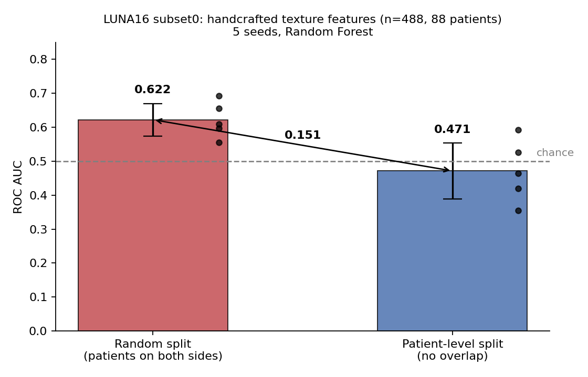

# Patient-level leakage in CT texture classification

**Short version:** handcrafted GLCM/LBP texture features appear to detect pulmonary
nodules on LUNA16 (AUC 0.622) when the data is split randomly. When the same data is
split by patient, performance falls to chance (AUC 0.471). The apparent signal is
patient memorisation, not pathology.



| Split | ROC AUC (5 seeds) | Mean F1 | Patients on both sides |
|---|---|---|---|
| Random (slice-level) | **0.622 ± 0.048** | 0.170 | 63.6 of 88 |
| Patient-level | **0.471 ± 0.083** | 0.102 | 0 |
| | **−0.151** | | |

Same features. Same model. Same data. Only the split differs.

---

## Background: how this started

This work began as a correction to my undergraduate thesis, which built a CT lung
cancer classifier on the IQ-OTH/NCCD dataset using handcrafted texture descriptors
(GLCM, LBP, Haralick) with classical classifiers, and reported **95.02% accuracy**.

While reimplementing the pipeline in Python I checked how the train/test split had
been constructed and found that slices from the same patients appeared on both sides.
IQ-OTH/NCCD contains 1,097 slices drawn from 110 patients, so a random slice-level
split places multiple slices of the same chest in both training and test data. The
model can score well by recognising individuals rather than disease.

I set out to correct this, and hit a second problem.

### IQ-OTH/NCCD cannot support a patient-level split

The public release of IQ-OTH/NCCD is distributed as three flat class folders with
filenames of the form:

```
Normal case (1).jpg
Malignant case (1).jpg
Bengin case (1).jpg
```

The numbering is a sequential index. **No case or patient identifier is preserved
anywhere in the release.** There is no manifest mapping slices to patients.

This means patient-level splitting is not merely difficult on this dataset — it is
impossible. It also means that no published result on IQ-OTH/NCCD can have used a
patient-level split, including the several papers reporting accuracies above 99%.
Those figures are not necessarily wrong, but they are **unverifiable**, and the
direction of the bias is known.

I therefore moved the experiment to LUNA16, which preserves `seriesuid` for every
candidate and permits the correct evaluation.

---

## What this repository contains

A minimal, reproducible demonstration on LUNA16 subset0:

- 488 candidate patches (122 positive, 366 negative) from 88 patients
- 64×64 axial patches extracted at annotated candidate coordinates
- 86 handcrafted features per patch: 72 GLCM properties (6 properties × 3 distances ×
  4 angles, quantised to 32 grey levels), 10 LBP histogram bins, 4 first-order statistics
- Random Forest (300 trees, balanced class weights)
- Five seeds, two splitting strategies, identical in every other respect

## Reproducing the result

The extracted features are committed, so the headline result runs in under a minute
with no CT data download:

```bash
pip install -r requirements.txt
python src/run_experiment.py
```

Expected output:

```
RANDOM   split  AUC 0.6221 +/- 0.0477   F1 0.1698
PATIENT  split  AUC 0.4713 +/- 0.0825   F1 0.1016

AUC inflation from leakage : +0.1508
mean patients on both sides: 63.6 of 88
```

Reproduced on three independent machines with scikit-learn 1.6, 1.8, and 1.9. Absolute AUC varies in the third decimal place across versions (random 0.611-0.622, patient-level 0.462-0.471) because Random Forest internals are not identical between releases. The inflation estimate is stable at 0.148-0.151, and patient-level performance remains below chance in every configuration tested.
To regenerate the features from raw LUNA16 volumes:

```bash
python src/extract_features.py --data-root /path/to/luna16 --subset 0
```

Only subset0 (~8 GB) is required. LUNA16 is available at
[luna16.grand-challenge.org](https://luna16.grand-challenge.org/) and is derived from
the LIDC-IDRI dataset.

---

## Reading the result honestly

**The patient-level AUC is 0.471, which is below chance.** Three of the five folds
fall under 0.5 (0.355, 0.419, 0.464). The correct interpretation is not that these
features are anti-predictive, but that they carry no usable signal for this task at
this sample size, and the fold-to-fold variation is large (± 0.083).

This is not a surprising result in itself. A 4 mm nodule occupies roughly 7 pixels at
typical LUNA16 in-plane resolution, and second-order texture statistics computed over
a 64×64 patch are dominated by surrounding parenchyma. The field uses 3D convolutional
architectures for this task for good reason.

What the comparison does establish is that **the 0.622 obtained under random splitting
is not a weak-but-real signal.** It is an artefact of evaluation design, and it would
have been reported as a modest positive result by anyone who did not check.

## Limitations

- **One subset.** 88 patients, 488 patches. Extending to subsets 0–4 (~440 patients)
  would tighten the confidence intervals substantially. Not yet done.
- **Negative subsampling.** Negatives are subsampled at 1:3. The true LUNA16 ratio is
  approximately 1:407 (1,351 positives against 549,714 negatives). Reported metrics
  therefore do not reflect screening performance, and both arms share this limitation.
- **2D single-slice patches.** Nodules are three-dimensional; a single axial slice
  discards most of the available context.
- **Voxel spacing is not resampled.** Spacing varies between scans in this dataset
  (0.53–0.76 mm in-plane, 1.25–2.5 mm between slices). Texture features are sensitive
  to this and resampling to isotropic voxels would be the standard correction.
- **The block-split approximation on IQ-OTH/NCCD is not included here.** Without
  patient identifiers it could only ever be a proxy, and a proxy result would weaken
  rather than strengthen the argument.

## Repository layout

```
├── README.md
├── requirements.txt
├── src/
│   ├── run_experiment.py      # reproduces the result from cached features
│   └── extract_features.py    # regenerates features from raw LUNA16 volumes
├── results/
│   ├── luna_features.npz      # X (488, 86), y (488,), uids (488,)
│   └── luna_5seed_results.json
└── figures/
    └── split_comparison.png
```

## The one-line fix

```python
# Leaky: patients can appear in both train and test
train_test_split(X, y, test_size=0.25, stratify=y)

# Correct: every patient is entirely in one side or the other
GroupShuffleSplit(test_size=0.25).split(X, y, groups=patient_ids)
```

The `groups` argument is the whole correction. It is available in scikit-learn,
costs nothing, and requires only that the dataset preserve patient identity — which
is precisely what many public medical imaging releases do not.

## Citation

LUNA16 / LIDC-IDRI:
Setio et al., *Validation, comparison, and combination of algorithms for automatic
detection of pulmonary nodules in computed tomography images: the LUNA16 challenge*,
Medical Image Analysis, 2017.

IQ-OTH/NCCD:
alyasriy & AL-Huseiny, *The IQ-OTH/NCCD lung cancer dataset*, Mendeley Data V4, 2023.
doi:10.17632/bhmdr45bh2.4

---

Asad Ali — Biomedical Engineering, University of Lahore
