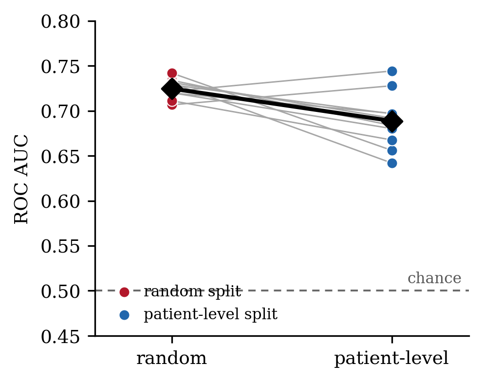
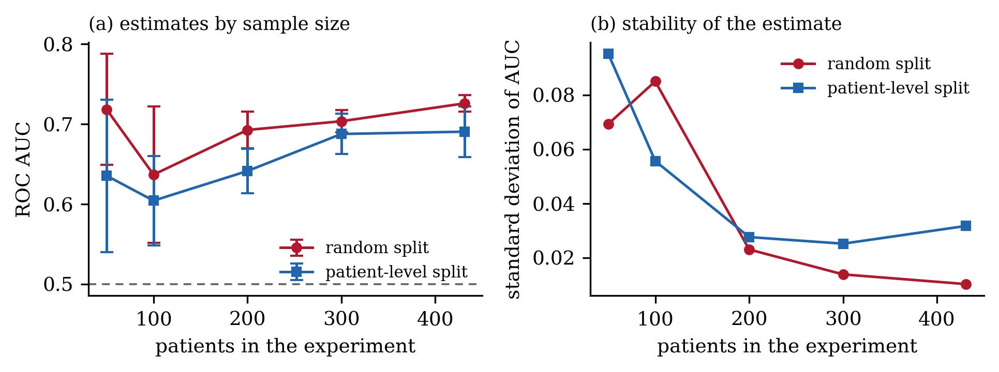

# Patient-level leakage in CT texture classification

**Short version:** handcrafted GLCM/LBP texture features detect pulmonary nodules
on LUNA16 with ROC AUC 0.689 ± 0.029 under patient-level splitting across 431
patients. Random slice-level splitting inflates this to 0.725 ± 0.010. The
inflation is 0.036 — real and consistent, but small — and it cannot be estimated
reliably from a small cohort.



| Split | ROC AUC (10 seeds) | Mean F1 | Patients on both sides |
|---|---|---|---|
| Random (slice-level) | **0.725 ± 0.010** | 0.211 | 334 of 431 |
| Patient-level | **0.689 ± 0.029** | 0.166 | 0 |
| | **−0.036** | | |

Same features. Same model. Same data. Only the split differs.

---

## A correction to an earlier version of this repository

An earlier version of this work used LUNA16 `subset0` only — 488 patches from 88
patients — and reported patient-level AUC of **0.471 ± 0.083**, concluding that
the texture features performed at chance and that all apparent signal was patient
memorisation.

**That conclusion was wrong.** On the full five-subset cohort the patient-level
AUC is 0.689, comfortably above chance, and none of ten folds falls below 0.5.
The features carry genuine, if modest, discriminative signal. The earlier result
was a small-sample artefact: at 88 patients the standard deviation of the
estimate was 0.083, wide enough to place the true value of 0.69 within reach of
an observed 0.47.

This correction is left visible rather than quietly overwritten, because it is an
instance of the same failure the repository documents: a small cohort, a wide
confidence interval, and a confident conclusion that did not replicate.



The standard deviation of the patient-level estimate falls from 0.095 at 50
patients to 0.032 at 431. Across cohort sizes the apparent inflation ranges from
0.016 to 0.083 with no monotone trend — the variation is sampling noise, not a
systematic effect of scale.

---

## Background: how this started

This began as a correction to my undergraduate thesis, which built a CT lung
cancer classifier on the IQ-OTH/NCCD dataset using handcrafted texture
descriptors with classical classifiers, and reported high accuracy.

While reimplementing the pipeline I checked how the train/test split had been
constructed and found that slices from the same patients appeared on both sides.
IQ-OTH/NCCD contains 1,097 slices from 110 patients, so a random slice-level
split places multiple slices of the same chest in both partitions.

I set out to correct this, and hit a second problem.

### IQ-OTH/NCCD cannot support a patient-level split

The public release is distributed as three flat class folders with filenames of
the form:

```
Normal case (1).jpg
Malignant case (1).jpg
Bengin case (1).jpg
```

The numbering is a sequential index. **No case or patient identifier is preserved
anywhere in the release,** and there is no manifest mapping slices to patients.

Patient-level splitting is therefore not merely unaddressed but unaddressable.
It also means no published result on IQ-OTH/NCCD can have used a patient-level
split, including papers reporting accuracies above 99%. Those figures are not
necessarily wrong, but they are **unverifiable**, and the direction of the bias
is known.

I moved the experiment to LUNA16, which preserves `seriesuid` for every candidate.

---

## Auditing public CT datasets for contamination

| Dataset | Files | Patients | Patient ID available? | Random-split contamination |
|---|---|---|---|---|
| IQ-OTH/NCCD | 1,097 | 110 | **No** | Unmeasurable |
| TCGA CT (Kaggle) | 100 | 54 | Yes, in DICOM headers | **68.8% of test set** |
| LUNA16 | 2,818 patches | 431 | Yes, `seriesuid` | 334 of 431 patients |

### TCGA CT: contamination is severe and undocumented

The `kmader/siim-medical-images` dataset contains 100 DICOM slices from The
Cancer Genome Atlas. It is widely used in tutorials.

Reading the DICOM headers — which the filenames do not expose — gives:

- **54 unique patients across 100 files**
- **6 exact duplicate slices**: same `PatientID`, same `SliceLocation`, different
  filename
- **28 patients contribute more than one file**; one contributes six

Over 20 random 80/20 splits, 11.9 of 54 patients appear in both partitions and
**68.8% of test images have a same-patient counterpart in training.** The
`PatientID` field required to prevent this is present in the headers and is
surfaced nowhere in the dataset description, filenames, or accompanying CSV.

### The audit takes ninety seconds

```python
df.PatientID.nunique()                                         # patients vs files
df.groupby(['PatientID','SliceLocation']).size().gt(1).sum()   # exact duplicates
df.PatientID.value_counts().head(10)                           # concentration
```

`src/audit_dataset.py` runs this against any DICOM directory or manifest CSV:

```bash
python src/audit_dataset.py --dicom-dir /path/to/dicom_dir
```

---

## Reproducing the result

Extracted features are committed, so the headline comparison runs in under two
minutes with no CT download:

```bash
pip install -r requirements.txt
python src/run_experiment.py
```

Expected output:

```
RANDOM   split  AUC 0.7247 +/- 0.0102
PATIENT  split  AUC 0.6888 +/- 0.0293
AUC inflation from leakage : +0.0359
```

To regenerate features from raw LUNA16 volumes (subsets 0–4, ~35 min):

```bash
python src/extract_features.py --data-root /path/to/luna16
```

LUNA16 is available at [luna16.grand-challenge.org](https://luna16.grand-challenge.org/)
and derives from LIDC-IDRI.

---

## Reading the result honestly

**The inflation is small.** 0.036 AUC, roughly 5% of reported performance. This
is smaller than some accounts of dataset leakage suggest, and the reason is
worth stating: nodule-versus-non-nodule is only weakly associated with patient
identity, since a single scan contributes both positive and negative candidates.

Where the label is a property of the *patient* rather than of the *location* — as
in whole-image disease classification, which is what my thesis did — patient
recognition solves a much larger share of the task, and the inflation should be
correspondingly greater. **The magnitude of leakage is task-dependent and a
single estimate should not be generalised across problem formulations.**

**The features work.** AUC 0.689 is modest but real. Applied to a
contrast-enhancement detection task on the TCGA collection, the identical pipeline
achieves AUC 0.871 under patient-level splitting, because contrast agent produces
a global, high-amplitude change. Nodule detection is harder: a 4 mm nodule
occupies roughly seven pixels, and in a single axial slice a spherical nodule and
a tubular vessel are both approximately circular.

## Limitations

- **Five of ten LUNA16 subsets.** 431 patients, 2,818 patches.
- **Negative subsampling at 1:3.** The true LUNA16 ratio is roughly 1:407, so
  reported metrics do not reflect screening performance. Both arms share this.
- **2D single-slice patches.** Nodules are three-dimensional.
- **Voxel spacing not resampled**, though it varies across scans (0.53–0.76 mm
  in-plane, 1.25–2.5 mm between slices).
- **The sample-size analysis draws from a single cohort**, so draws are not
  independent; standard deviations are indicative rather than formal confidence
  intervals.

## Repository layout

```
├── README.md
├── requirements.txt
├── src/
│   ├── run_experiment.py      # reproduces the result from cached features
│   ├── extract_features.py    # regenerates features from raw LUNA16
│   └── audit_dataset.py       # contamination audit for any DICOM dataset
├── results/
│   ├── luna_5subsets.npz      # X (2818, 86), y, uids — 431 patients
│   └── results_v2.json
└── figures/
```

## The one-line fix

```python
# Leaky: patients can appear in both train and test
train_test_split(X, y, test_size=0.25, stratify=y)

# Correct: every patient is entirely in one side or the other
GroupShuffleSplit(test_size=0.25).split(X, y, groups=patient_ids)
```

The `groups` argument is the whole correction. It costs nothing and requires only
that the dataset preserve patient identity — which is precisely what many public
medical imaging releases do not.

## Citation

LUNA16 / LIDC-IDRI: Setio et al., *Validation, comparison, and combination of
algorithms for automatic detection of pulmonary nodules in computed tomography
images: the LUNA16 challenge*, Medical Image Analysis, 2017.

IQ-OTH/NCCD: alyasriy & AL-Huseiny, *The IQ-OTH/NCCD lung cancer dataset*,
Mendeley Data V4, 2023. doi:10.17632/bhmdr45bh2.4

---

Asad Ali — Biomedical Engineering, University of Lahore
